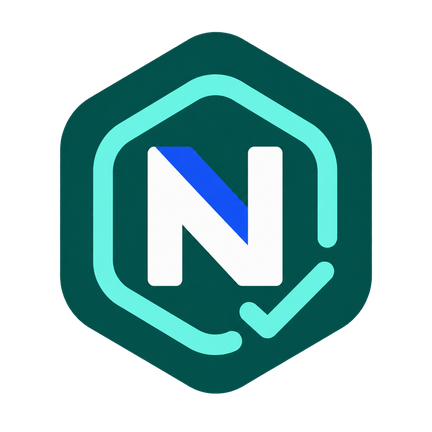
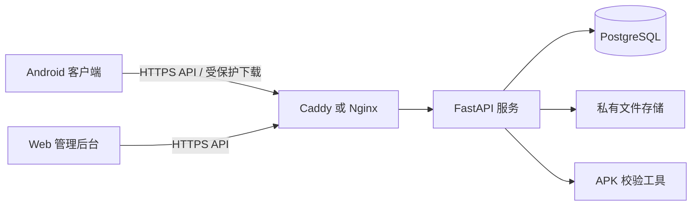

# NEXT Beta 内测平台

<p align="center">
  
</p>

面向公司内部 Android 测试用户的轻量应用分发与反馈平台。管理员在 Web 后台上传 APK、维护版本与展示素材，并通过测试组控制可见范围；测试用户在 Android 客户端登录后下载应用、调起系统安装界面、查看处理进度并提交带截图的 Bug。

> 当前版本用于不超过 100 人的小规模公网内测。仓库不包含生产数据库、账号密码、APK 成品、签名私钥或服务器运行时数据。

## 主要功能

### Web 管理后台

- 应用、版本、Logo、截图和更新说明管理
- 测试组、用户及应用可见范围管理
- Bug 查看、处理、回复、验证与关闭
- 下载开始、客户端确认完成等记录查询
- 关键管理操作审计
- 列表管理模式、批量操作、归档和密码二次确认后的永久删除

### Android 客户端

- 手机号与管理员分配的密码登录，支持首次登录改密
- 按测试组展示可参与内测的应用
- APK 断点下载、摘要/包名/版本/签名校验
- 根据安装状态显示“安装”“打开”或更新操作
- 每 7 天检查一次 NEXT Beta 客户端新版本
- 从系统照片选择器添加截图并提交 Bug
- 查看 Bug 状态、评论、处理结论与验证结果

## 系统结构



## 目录说明

| 目录 | 内容 |
| --- | --- |
| `server/` | FastAPI API、Web 管理后台、Alembic 迁移、测试与部署脚本 |
| `android-client/` | Jetpack Compose 内测客户端 |
| `test-app/` | 用于验证下载、安装与启动链路的独立 Android 测试应用 |
| `ui-prototype/` | Web 与 Android 关键界面原型 |
| `distribution/android/` | 客户端公开下载页和更新清单格式示例，不含 APK |
| `docs/` | 需求、架构、安全、验收和 Stitch 设计资料 |

## 本地启动服务端

需要 Python 3.12 和 [uv](https://docs.astral.sh/uv/)。本地开发默认使用 SQLite；正式环境使用 PostgreSQL，并通过 Alembic 显式迁移。

```bash
cd server
uv sync --frozen
cp .env.example .env
uv run alembic upgrade head
uv run uvicorn beta_center.main:app --host 127.0.0.1 --port 8088
```

启动后访问：

- 健康检查：`http://127.0.0.1:8088/health/live`
- 管理后台：`http://127.0.0.1:8088/admin`

首次管理员应通过交互式命令创建，避免密码出现在命令历史和日志里。完整步骤见 [服务端说明](server/README.md)。

## 构建 Android 客户端

需要 JDK 17、Android SDK 37 和 Build Tools 36.0.0。

```bash
cd android-client
./gradlew \
  -PbetaApiBaseUrl=https://your-beta.example.com \
  :app:testDebugUnitTest :app:lintDebug :app:assembleDebug
```

调试 APK 位于 `android-client/app/build/outputs/apk/debug/app-debug.apk`。正式分发前必须配置公司自己的 release 签名；仓库不会保存 keystore 或密码。

测试应用可单独构建：

```bash
cd test-app
./gradlew testDebugUnitTest lintDebug assembleDebug
```

## 运行检查

服务端：

```bash
cd server
uv run ruff check .
uv run mypy src
uv run pytest
```

Android：

```bash
cd android-client
./gradlew :app:testDebugUnitTest :app:lintDebug
```

## 部署与更新目录

- Docker 隔离部署说明见 [server/README.md](server/README.md)。
- CentOS 7 测试机的原生部署说明见 [server/deploy/native/README.md](server/deploy/native/README.md)。该方案明确保留 443 给现有 VPN 服务，应用使用独立端口，部署脚本不修改 VPN 配置。
- Android 客户端更新目录固定为 `/downloads/android/`；文件名使用 `NEXT-Beta-android-x.y.z.apk`，机器读取的清单为 `index.json`。
- 下载页源码和清单示例见 [distribution/android/README.md](distribution/android/README.md)。

## 安全约束

- APK、截图、下载票据和附件不能作为公开静态文件暴露。
- 每次应用详情、Bug、附件和下载请求都必须重新校验测试组权限。
- 生产环境必须设置强随机应用密钥，并使用安全的数据库凭据。
- 不提交 `.env`、数据库、备份、运行日志、keystore、APK、构建缓存或测试账号。
- 上传 APK 时校验包名、版本、签名和 SHA-256；平台不托管签名私钥。
- 永久删除属于高风险管理操作，必须由当前管理员再次输入密码确认并写入审计记录。

发现安全问题时请遵循 [SECURITY.md](SECURITY.md)，不要在公开 Issue 中披露账号、下载票据、截图或服务器信息。

## 文档入口

- [需求分析 V0.2](docs/需求分析-V0.2-内测平台.md)
- [服务端架构与威胁模型](docs/服务端架构与威胁模型.md)
- [服务端技术选型记录](docs/服务端技术选型记录.md)
- [服务端验收矩阵](docs/服务端验收矩阵.md)
- [Stitch 提示词与项目框架](docs/stitch/NEXT-Stitch-提示词与项目框架.md)

## 许可

公司内部项目，未授予开源许可。除非获得项目所有者书面授权，不得复制、分发或对外部署。
